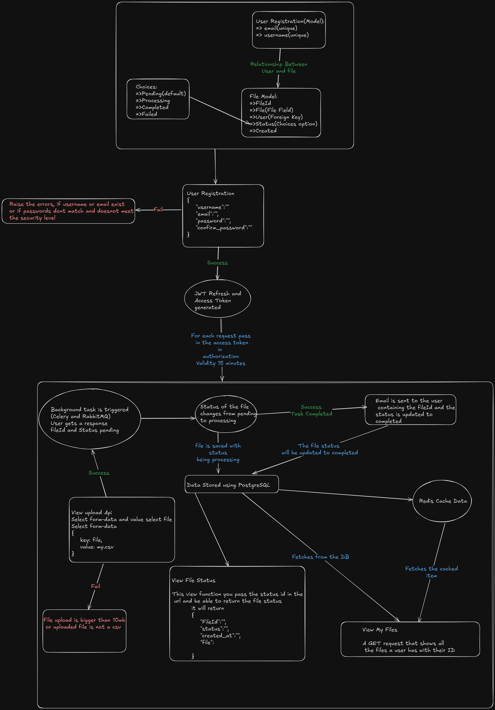

# CSV Processor

This Django project allows users to register, upload CSV files, and track processing status. Files are processed asynchronously using **Celery + RabbitMQ**, stored in **PostgreSQL**, cached in **Redis**, and email notifications are sent when processing completes.

The system is deployed locally on **Kubernetes** via **Minikube**.

> **Authentication** is handled using **Simple JWT** for secure access and refresh tokens.

> 🎯 [View architecture diagram on Excalidraw](https://excalidraw.com/#json=ZMavfzwjuVV2qRPJdpmSg,ukHCTYdtGRu6cR467zi44Q)

---

## Table of Contents

* [Requirements](#requirements)
* [Getting Started](#getting-started)

  * [Clone the Project & Set Up .env](#clone-the-project--set-up-env)
  * [Start Minikube](#start-minikube)
  * [Set Docker Env](#set-docker-env)
  * [Build Docker Image](#build-docker-image)
  * [Deploy to Kubernetes](#deploy-to-kubernetes)
  * [Access the Application](#access-the-application)
* [Verify Everything is Running](#verify-everything-is-running)
* [API Usage](#api-usage)

  * [User Registration](#user-registration)
  * [User Login](#user-login)
  * [Upload CSV File](#upload-csv-file)
  * [Check File Status](#check-file-status)
  * [View My Files](#view-my-files)
* [Run Tests Inside Kubernetes](#run-tests-inside-kubernetes)
* [View Live Celery Task Logs](#view-live-celery-task-logs)
* [Troubleshooting](#troubleshooting)
* [Architecture Overview](#architecture-overview)

---

## Requirements

* [Minikube](https://minikube.sigs.k8s.io/docs/start/)
* [kubectl](https://kubernetes.io/docs/tasks/tools/)
* [Docker](https://docs.docker.com/get-docker/)
* [Postman](https://www.postman.com/) or `curl` for API testing

---

## Getting Started

### Clone the Project & Set Up `.env`

```bash
git clone https://github.com/ritiko/wayne-interview-temp.git
cd wayne-interview-temp
touch .env
```

Then open `.env` in a text editor and paste the following content, updating values accordingly:


```env
SECRET_KEY=your_django_secret_key
DEBUG=True  # Set to False in production

# Email Configuration
EMAIL_BACKEND=your_default_email_backend
EMAIL_HOST=your_default_email_host
EMAIL_PORT=587
EMAIL_USE_TLS=True
EMAIL_HOST_USER=your_default_email_user
EMAIL_HOST_PASSWORD=your_default_email_password
DEFAULT_FROM_EMAIL=your_default_from_email
```

> If using Gmail, you’ll need an [App Password](https://support.google.com/accounts/answer/185833) instead of your regular password.

---

### Start Minikube

```bash
minikube start --driver=docker
minikube status
```

Ensure output includes:

```
host: Running
kubelet: Running
apiserver: Running
kubeconfig: Configured
```

---

### Set Docker Env

Use Minikube’s Docker daemon:

```bash
eval $(minikube docker-env)
```

---

### Build Docker Image

From project root:

```bash
docker build -t csv-app-image .
```

---

### Deploy to Kubernetes

Apply all Kubernetes manifests:

```bash
kubectl apply -f k8s/namespace.yaml
kubectl apply -f k8s/redis.yaml
kubectl apply -f k8s/rabbitmq.yaml
kubectl apply -f k8s/postgres.yaml
kubectl apply -f k8s/app.yaml
kubectl apply -f k8s/celery.yaml
```

---

### Access the Application

Forward Django service to your local machine:

```bash
kubectl port-forward -n csv-processor service/django-app 8000:8000
```

Open your browser at: [http://127.0.0.1:8000](http://127.0.0.1:8000)

---

## Verify Everything is Running

Check all services and pods:

```bash
kubectl get all -n csv-processor
```

Ensure all pods show `Running` status.

---

## API Usage

### User Registration

**POST** `/api/user/register/`

```json
{
  "username": "user",
  "email": "user1@gmail.com",
  "password": "Ktyr!906",
  "confirm_password": "Ktyr!906"
}
```

**Response**:

```json
{
  "username": "user1",
  "email": "user1@gmail.com"
}
```

---

### User Login

**POST** `/api/login/`

```json
{
  "email": "user1@gmail.com",
  "password": "Ktyr!906"
}
```

**Response**:

```json
{
  "refresh": "<refresh_token>",
  "access": "<access_token>"
}
```

> Use the access token in headers:

```
Authorization: Bearer <access_token>
```

---

### Upload CSV File

**POST** `/api/file/upload/`
**Headers**: `Authorization: Bearer <access_token>`
**Body**: form-data

* Key: `file`
* Value: select `.csv` file

**Validation Errors**:

```json
{ "file": ["Only CSV files are allowed."] }
```

```json
{ "file": ["File size must not exceed 10MB."] }
```

**Success Response**:

```json
{
  "file": "http://127.0.0.1:8000/media/uploads/filename.csv",
  "fileId": "uuid",
  "status": "pending"
}
```

---

### Check File Status

**GET** `/api/file/status/<fileId>/`
**Headers**: `Authorization: Bearer <access_token>`

**Example (Processing)**:

```json
{
  "fileId": "uuid",
  "status": "processing",
  "created_at": "2025-07-06T12:42:13.927626Z",
  "file": "http://127.0.0.1:8000/media/uploads/filename.csv"
}
```

**Example (Completed)**:

```json
{
  "file": "http://127.0.0.1:8000/media/uploads/filename_completed.csv",
  "fileId": "uuid",
  "status": "completed"
}
```

📧 An email is sent once processing completes.

---

### View My Files

**GET** `/api/file/my-files/`
**Headers**: `Authorization: Bearer <access_token>`

**Response**:

```json
[
  {
    "fileId": "fac086a5-80e8-4a7f-9d41-9de8fa90b737",
    "created_at": "2025-07-06T12:46:17.362064Z"
  },
  {
    "fileId": "1ed06c89-e5b0-45f1-9340-f958ab106222",
    "created_at": "2025-07-06T12:42:13.927626Z"
  }
]
```

---

## Run Tests Inside Kubernetes

To run test cases inside the Django pod:

```bash
kubectl exec -it -n csv-processor deployment/django-app -- python manage.py test
```

Sample output:

```
Creating test database for alias 'default'...
System check identified no issues (0 silenced).
............................
----------------------------------------------------------------------
Ran 28 tests in 10.814s
OK
```

---

## View Live Celery Task Logs

To stream logs from the Celery worker:

```bash
kubectl logs -n csv-processor -l app=celery -f
```


## Troubleshooting

| Problem                | Fix                                                                  |
| ---------------------- | -------------------------------------------------------------------- |
| Pods stuck in Pending  | `kubectl describe pod <name> -n csv-processor` and check storage     |
| Can't access 127.0.0.1 | Ensure `kubectl port-forward` is running                             |
| Reset everything       | `minikube stop && minikube delete && minikube start --driver=docker` |

---

## Architecture Overview

**Components:**

* **Django REST API** – User registration, login, file upload, and status
* **PostgreSQL** – Stores users and file metadata
* **Celery** – Background CSV file processor
* **RabbitMQ** – Message broker for Celery
* **Redis** – Cache layer for fast access to file
* **Kubernetes** – Manages deployments, services, volumes

